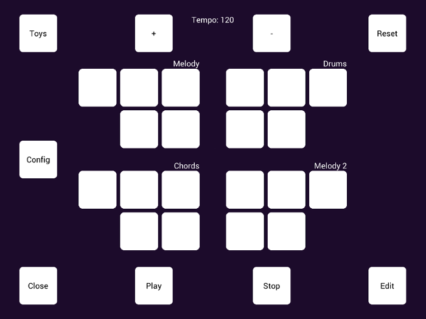

# Microsoft Hands-Free Sound Jam

Microsoft Hands-Free Sound Jam, or "MSHFSJ", 
is an eye-controlled music environment for electronic loop-based 
performance and composition. It is designed using familiar design paradigms 
found in commercial music production software, which have been adapted to work 
well with eye control. The core interface revolves around what is known as a 
clip launcher, inspired by the the one found in the popular digital audio 
workstation Ableton Live. Using the MSHFSJ clip launcher, one is able perform a 
piece of music by scheduling, or "launching", small musical fragments known as 
"clips". These clips are automatically aligned and quantized to the next downbeat of 
the song. Editing capabilities are provided through an editing window, where 
clips can be modified or rewritten entirely. Modified musical content will 
automatically be loaded and saved when the application is open and closed. 

MSHFSJ uses the PCEye Mini via the Tobii Stream Engine API for eye tracking. 
Graphics are drawn using OpenGL via 
[NanoVG](https://www.github.com/memononen/nanovg), a lightweight 2d vector 
graphics library. Persistent data storage is provided via 
[SQLite](https://www.sqlite.org). 
Realtime audio is achieved using 
[RtAudio](https://www.github.com/thestk/rtaudio), and digitial signal processing is 
built on top of the musical audio signal processing library 
[Soundpipe](http://www.pbat.ch/proj/soundpipe.html).

## Usage

Please refer to the [Usage](usage.md) file.

## Setup

### Windows 10

The Windows build uses the [MSYS2 environment](http://msys2.org). 

Full instructions on building for on Windows can be found with the 
document [build-on-windows.md](build-on-windows.md).

### Linux

On Linux, it's business as usual. You will need a few dependencies to be 
installed, including JACK, and GLFW3.

On Linux, run:

    make linux

Before running the program, assets from the other parts of this repository 
need to be transferred. Do this with:

    make transfer

Then run the program:

    ./MicrosoftHandsFreeSoundJam

## Mac OSX

Mac OSX can be built from the commandline using the provided Makefile system:

    make osx

Then the program can be run with:

    ./MicrosoftHandsFreeSoundJam

## Screenshots

## Internal Engine Documentation

- [Minimum viable product API overview](src/dsp/jam/MVP.md)
- [General MSHFSJ functionality](src/dsp/jam/README.md)
- [Clips](src/dsp/jam/clip.md)
- [Tracks](src/dsp/jam/tracks.md)
- [Mixer](src/dsp/jam/mixer.md)
- [Data persistence and Database functionality](src/dsp/jam/db.md)
- [Clip Editing Interface](src/dsp/jam/edit.md)
