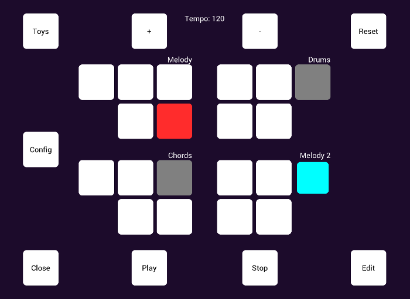
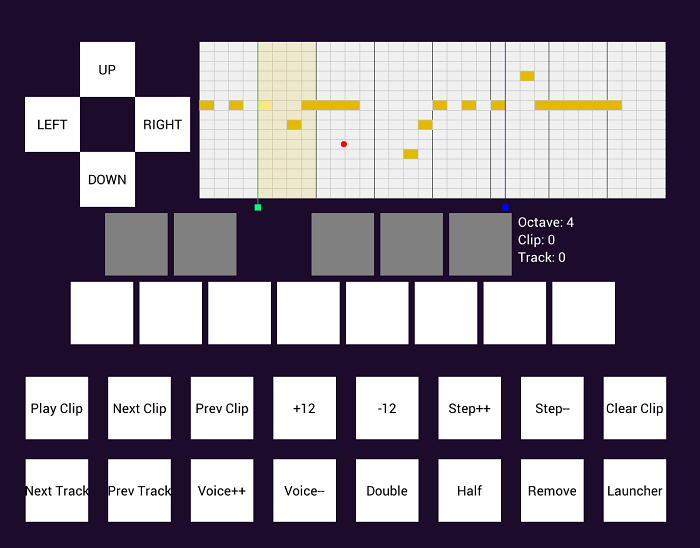

# EyeJam

By Paul Batchelor

EyeJam is an eye-controlled musical performance and composition environment. 
The core interface implements what is known as a clip launcher, based on the
the one found in the popular digital audio workstation Ableton Live.
In EyeJam, one is able to launch small musical fragments known as "clips", 
which are automatically aligned to the beat of the song. Clips can be launched
and mixed together in various combinations to play a song. 

This version of EyeJam is a prototype. The front UI aspects are written
in C using OpenGL via [NanoVG](http://www.github.com/memononen/nanovg) and
GLFW, and is meant to eventually be replaced with a Windows UI layer. 

## Usage

Please refer to the [Usage](usage.md) file.

## Setup

On Windows, use the msys2 environment. On Linux, business as usual. Eye 
control is only available Windows. 

First, make sure libwhisper.a is compiled. In the 
[whisper32 DSP directory](src/dsp), run 
    
    make libwhisper.a

Now eyejam can be compiled. 

On Linux, run:

    make linux

On Windows, run:

    make windows

For high-resolution windows displays (such as the surface), run:

    make windows-highres

Full instructions on building for on Windows can be found with the 
document [build-on-windows.md](build-on-windows.md).

Before running the program, assets from the other parts of this repository 
need to be transferred. Do this with:

    make transfer

## Screenshots

## Internal Engine Documentation

- [Minimum viable product API overview](src/dsp/eyejam/MVP.md)
- [General EyeJam functionality](src/dsp/eyejam/README.md)
- [Clips](src/dsp/eyejam/clip.md)
- [Tracks](src/dsp/eyejam/tracks.md)
- [Mixer](src/dsp/eyejam/mixer.md)
- [Data persistence and Database functionality](src/dsp/eyejam/db.md)
- [Clip Editing Interface](src/dsp/eyejam/edit.md)
