# Usage

A visual guide to using MSHFSJ, an eye-controlled application for 
realtime-oriented music performance and composition.

## The Clip Launcher

The main interface to MSHFSJis the clip launching window. This is the window
seen when MSHFSJ first starts. 

The internal clock plays by default, but there is no sound. In order to 
make any sound, a clip needs to be launched. A **clip** is a short chunk of 
music (be it melodic, harmonic/chordal, or percussive in nature). Compositions
in MSHFSJ are composed of little clips that can be mixed and matched together.
A clip in eyejam is tied to a specific instrument in what is known as a
**clip region**.

### Clip Regions

A clip region is a group 5 clips. If you use your imagination, they kind of look 
like ponies. 

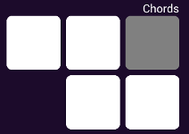

There are 4 clip regions inside of MSHFSJ. Each region controls a different
kind of instrument: Melody, Melody 2, Drums, and Chords.

### Selecting a Clip
Each clip inside a clip region is represented by a white square button. 
Dwelling on a clip will cause it to be selected.

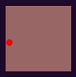

### Scheduled clips

A selected clip will often briefly be a cyan color and pulse to the beat:

This means that the particular clip is **scheduled** to be played. A clip
will wait until the next *downbeat* (first beat of a measure) to play the clip. 
That way, the clip being played is *quantized* and aligned precisely to the
beat of the song.

### Playing Clips

A clip that is currently is being played will show up as grey:

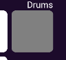

There can only be one playing clip per clip region. 

### Turning off clips

The way to turn off a clip depends on the mode they are in.
Clips can either be in looped mode or single-shot mode. 
The clips melody clip region are in single-shot mode: the clip will play, and 
will automatically turn themselves off when they reach the end of their clip.
Looping clips will play continuously, and can be stopped by re-launching the
clip, or selecting another clip in the region.

### Reset Button

Dwelling on the **reset button** will cause all the clips to immediately turn
off. 

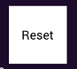

### Play Button

Dwelling on the **play button** will resume playback of Eyejam, assuming it 
is stopped.

### Stop Button

Dwelling on the **stop button** will stop all sound for MSHFSJ. 

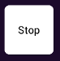

### Tempo Control 

Dwelling on the +/- buttons will increase/decrease the tempo by 5 BPM. 

### Toys

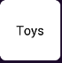

Dwelling on the Toys button takes you to the "Toys" screen, where
miscellaneous features and toys in SoundJam are contained.

### Config

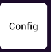

Dwelling on the Config button takes you to the configuration screen
for fine-tuned configuration options.

### Edit Screen

Dwelling on the edit button takes you to the clip editor screen.

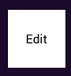

## The Clip Editor

The clip editor is a general purpose editor for reprogramming clips found on
the clip launcher page. It features a piano roll for visualizing notes in time, 
and a series of buttons used to insert or remove notes in a given clip. 

### The Piano Roll

The piano roll is the used to visualize note information of the currently
selected clip. It can be read like a bar graph. Time moves on the x-axis in
equal steps, and pitches are plotted on the Y axis. 

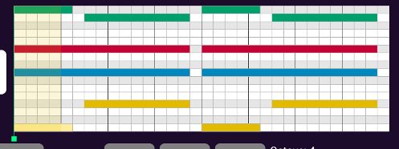

### The Edit Playhead

The edit playhead is a green line which tells you where the current edit 
position is. This is analogous to an edit cursor in a word processor. A 
semi-transparent rectangle follows the edit playhead. This displays this
current edit step size. Notes that are inserted will also be at this length
as well.

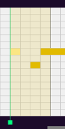

### The Playback Playhead

When a clip is playing, a vertical blue line will appear, indicated where
the current playback position is.

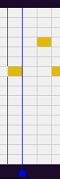

### Navigation

The navigation buttons are found to the left of the piano roll. The left and
right keys move the playhead position forwards and backwards in time in 
edit step increments. The up and down keys scroll piano roll up and down, and
can be used to see notes out of range.

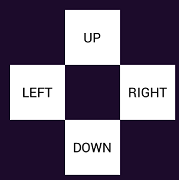

### Keyboard Input

The way to input notes into a clip is to use the keyboard interface. These
are series of buttons arranged to be a keyboard. When a note is pressed,
it will be inserted at the current edit position. The edit cursor will then 
move to the end of the note. The duration of the note is determined by the
edit step size.

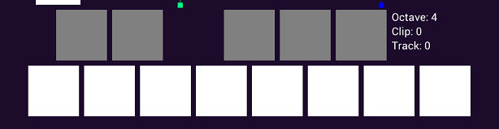

### Information

To the right of the keyboard, additional information about the current melody
editor state is displayed. **Octave** refers to the current keyboard octave. 
**Clip** refers to the current clip number being edited. **Track** refers
to the current track being edited.

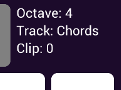

### Clip Operations

**Play Clip** will launch the clip currently being edited. 
**Next Clip** will go to the next clip in the track.
**Prev Clip** will go to the previous clip in the track.

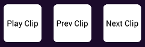

### Clear a clip
The button **Clear Clip** will clear all note information in the currently
selected clip.

### Track Operations
**Next Track** will select the next instrument track.
**Prev Track** will select the previous instrument track.

### Changing Edit Step Size
**Step++** will increase the step size by 1.
**Step--** will decrease the step size by 1.

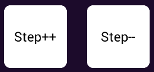

### Doubling and Halving Step Size
Often there are situations where changing the step size is too slow. 
The **Double** and **Half** buttons will double and halve the current edit step 
size.

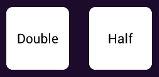

### Removing a Note
The button **Remove** will remove a note. In order for a note to be removed, the
edit playhead must be at the beginning of the note. For polyphonic passages,
the correct voice channel must be selected.

### Polyphony 
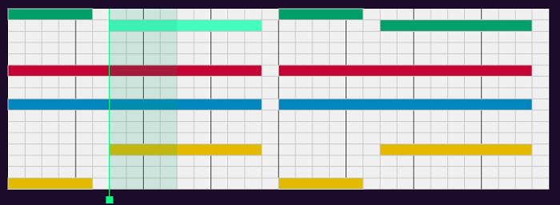

Polyphony editing in MSHFSJ is a little strange compared to other DAWs. This
is largely due to how things are handled under the hood (the MSHFSJ 
implemenation is simpler). A polyphonic instrument such as the drum kit or
the instrument for chord progressions has what will be referred as 
**voice channels**, where a particular voice is assigned to a particular 
channel. In eyejam, a maximum of 4 voice channels are implemented. 
As seen in the picture above, the voice channels are color coded: 
channel 1 is yellow, channel 2 is blue, channel 3 is red, and channel 4 
is green. 

The current voice channel can be changed using the **voice++** and the
**voice--** to increase and decrease the voice channel. The current channel
is indicated by the colored tint of the edit cursor bar. 

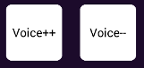

## The Toys Screen

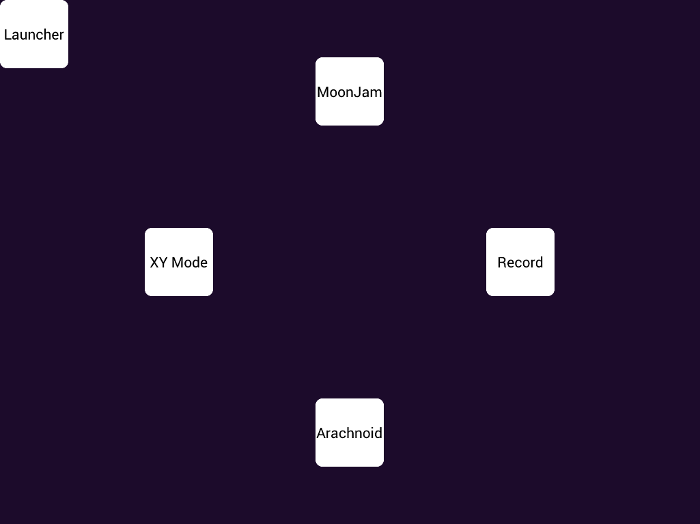

SoundJam has many experimental and quirky eye-controlled interfaces.
These can be found in the Toys Screen. 

The Toys screen conists of 5 buttons total. 

### The Launcher Button

The Launcher button is located in the top left corner. 
Dwelling on it will take you back to the main clip launcher screen.

### XY Mode

Dwelling on the XY control button turns on XY mode. In XY mode, 
a global filter and feedback delay effect is turned on. The XY position of the
eye pointer continuously maps to the effect parameters. The X-axis maps to
delay feedback amount and filter resonance, and the Y-axis maps to filter 
cutoff.

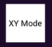

### MoonJam

Dwelling on the MoonJam button launches the MoonJam musical interface. 

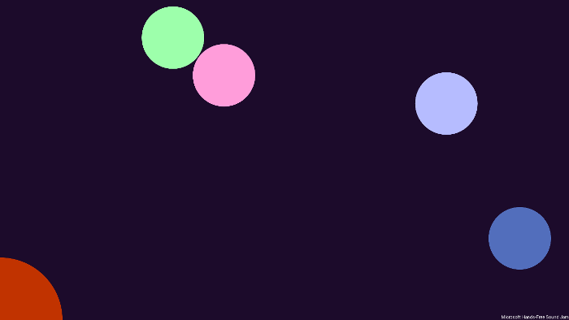

Moon Jam is an interactive and generative audio-visual work by Paul Batchelor, 
driven entirely through eye tracking. In Moon Jam, one is presented with a set 
of pastel colored circles called "moons". Gazing at a moon causes it to burst, 
creating a musical note which contributes to the ambient soundtrack. Looking at 
the red circle in the bottom left corner causes the screen to whitewash and 
fade out.

### Arachnoid

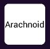

Dwelling on the Arachnoid button launches the Arachnoid Musical interface.

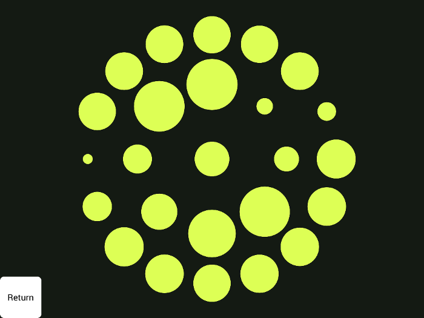

Arachnoid is an eye controlled virtual sound sculpture by Paul Batchelor. 
Inspired by insects and trypophobia, Arachnoid presents a set of circles 
reminiscent of the eyes on a spider. Gazing at any of the circles causes it to 
pop, creating a chittering gurgle that aims to be both satisfying, 
uncomfortable, and for some, even playful. 

### Record

Dwelling on the Record button will begin recording audio. Audio will be 
saved to a file called "output.wav" inside the current working directory.
Record mode is indicated by the greyed out button as well as a thin red border
along the edges of the screen. Dwelling on the record button again will stop
recording. Each time recording is turned on, it will overwrite the previous 
file.

## The Configuration Screen

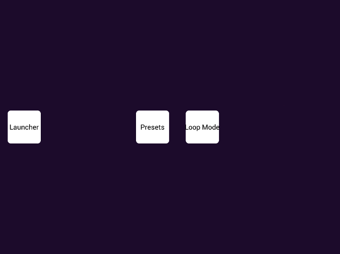

The configuration screen contains a button menu for fine-tuned configuration
of SoundJam. 

### Presets

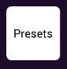

Dwelling on the "Presets" button takes you to the preset screen.

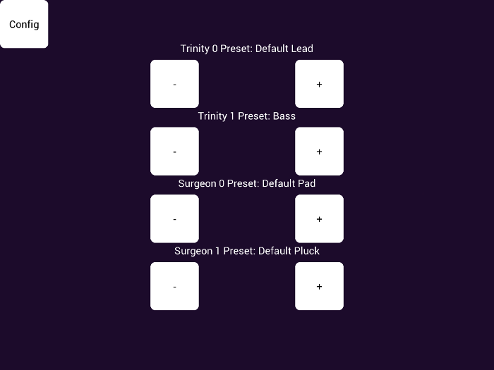

The various synths that power MSHFSJ have parameters that can be reconfigured
to play different sounds and timbres through the use of presets. Hitting "+"
or "-" will navigate through the presets. After each instrument label,
the name of the preset will be printed, 
(ex: "Trinity 0 Preset: Default Lead").

The synths are associated to the
following tracks:

- Trinity 0 is bound to the Melody track
- Trinity 1 is bound to the Chords track (typically a bassline)
- Surgeon 0 is bound to the Chords track (typically for Chords)
- Surgeon 1 is bound to the Melody 2 track

### Loop Mode

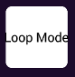

Dwelling on the "Loop Mode" button takes you to the loop mode screen.

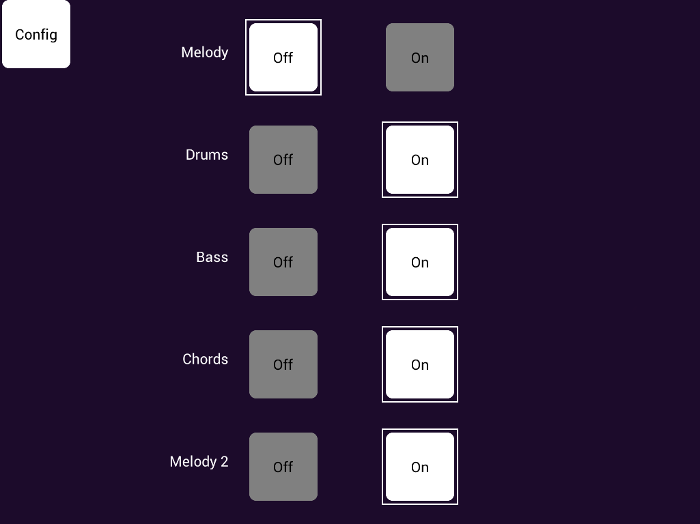

The loop mode screen toggles loop mode on a particular track. When loop mode
is enabled, launched clips associated with that track will continuously loop.
It should be noted that the bass track and the chords track are merged 
together into the "Chords" button region.
